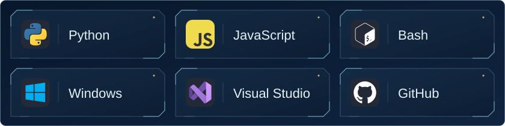

  

  Local LLMs · AI Agents · Automation 
  探索本地大模型、AI Agent 与自动化

  <a href="https://github.com/KiritoYG?tab=repositories">Repositories</a> ·
  <a href="https://github.com/KiritoYG/YUI-MHCP0011">YUI</a> ·
  <a href="https://github.com/KiritoYG?tab=overview#contribution-activity">Activity</a>

## ◇ About Me

- **Building:** 本地大模型部署与 AI Agent 架构重构
- **Learning:** Python 进阶与底层框架探索
- **Interests:** AGI、LLM、自动化脚本

## ✦ Yui · Daily Insight

<table>
<tr>
<td width="112" align="center" valign="middle">
 
YUI · ユイ
</td>
<td width="728" valign="middle">
<strong>ユイから、今日のひとこと。</strong>  
<!-- YUI_START -->
2026-09-24 · パパ、今日も一歩ずつ進めば大丈夫だよ！
<!-- YUI_END -->
</td>
</tr>
</table>

## ⚔ Tech Stack

  

JavaScript · Python · Windows · Visual Studio · GitHub · Bash

## ◈ On GitHub

[Repositories](https://github.com/KiritoYG?tab=repositories) · [Contributions](https://github.com/KiritoYG?tab=overview#contribution-activity) · [Stars](https://github.com/KiritoYG?tab=stars)

## ⌁ Contribution Animation

<picture>
  <source media="(prefers-color-scheme: dark)" srcset="https://raw.githubusercontent.com/KiritoYG/KiritoYG/output/github-contribution-grid-snake-dark.svg">
  <source media="(prefers-color-scheme: light)" srcset="https://raw.githubusercontent.com/KiritoYG/KiritoYG/output/github-contribution-grid-snake.svg">
  
</picture>

✦ &nbsp; また、ここで。 &nbsp; ✦

