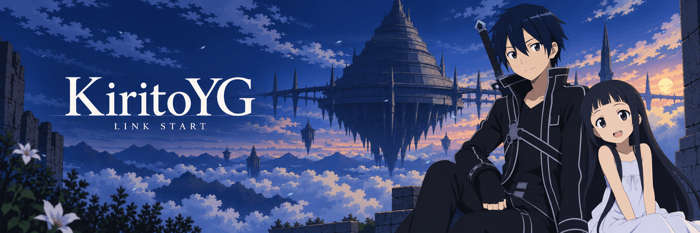
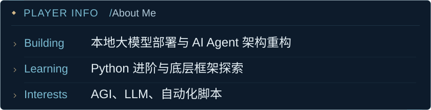
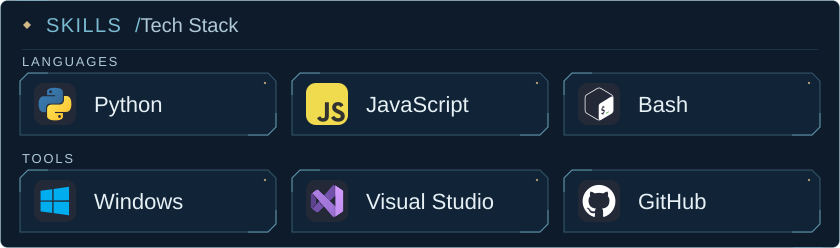
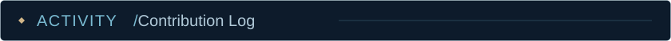
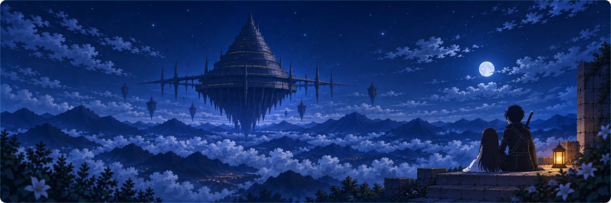

  

  <strong>ようこそ、僕たちの小さな世界へ。</strong> 
  欢迎来到我们的小小世界。

  Local LLMs · AI Agents · Automation 
  探索本地大模型、AI Agent 与自动化

  <a href="https://github.com/KiritoYG?tab=repositories">Repositories</a> &nbsp;·&nbsp;
  <a href="https://github.com/KiritoYG/YUI-MHCP0011">YUI</a> &nbsp;·&nbsp;
  <a href="https://github.com/KiritoYG?tab=overview#contribution-activity">Activity</a> &nbsp;·&nbsp;
  <a href="https://github.com/KiritoYG?tab=stars">Stars</a>

  <picture>
    <source media="(max-width: 600px)" srcset="./assets/player-info-mobile.svg">
    
  </picture>

  <picture>
    <source media="(max-width: 600px)" srcset="./assets/yui-dialogue-mobile.svg">
    
  </picture>

  <picture>
    <source media="(max-width: 600px)" srcset="./assets/skill-slots-mobile.svg">
    
  </picture>

  <picture>
    <source media="(max-width: 600px)" srcset="./assets/activity-label-mobile.svg">
    
  </picture>

<picture>
  <source media="(prefers-color-scheme: dark)" srcset="https://raw.githubusercontent.com/KiritoYG/KiritoYG/output/github-contribution-grid-snake-dark.svg">
  <source media="(prefers-color-scheme: light)" srcset="https://raw.githubusercontent.com/KiritoYG/KiritoYG/output/github-contribution-grid-snake.svg">
  
</picture>

<a href="https://github.com/KiritoYG?tab=overview#contribution-activity">View contribution activity</a>

  

  <strong>また、ここで。</strong> 
  下次，也在这里。

文字版 · Profile &amp; Yui's daily message

<strong>About Me</strong>

<ul>
  <li><strong>Building:</strong> 本地大模型部署与 AI Agent 架构重构</li>
  <li><strong>Learning:</strong> Python 进阶与底层框架探索</li>
  <li><strong>Interests:</strong> AGI、LLM、自动化脚本</li>
</ul>

<strong>Yui · Daily Insight</strong> ユイから、今日のひとこと。

<!-- YUI_START -->
2026-09-24 · パパ、今日も一歩ずつ進めば大丈夫だよ！
<!-- YUI_END -->

<strong>Tech Stack:</strong> Python · JavaScript · Bash · Windows · Visual Studio · GitHub

